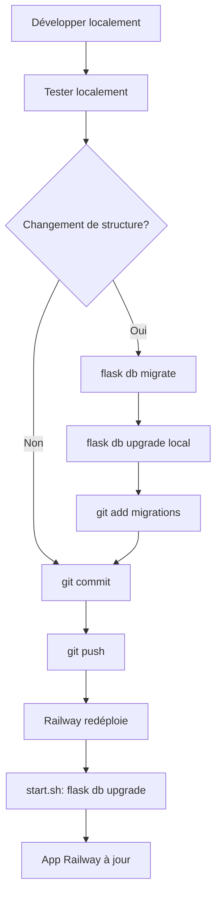

# 🔄 Workflow de développement Local ↔ Railway

Ce guide explique comment développer localement tout en gardant Railway synchronisé.

## 🎯 Principe de base

**Local** = environnement de développement avec données de test  
**Railway** = production avec vraies données clients

## 📋 Workflow recommandé

### 1️⃣ **Modifications de STRUCTURE (modèles/tables)**

Quand vous modifiez `models.py` :

```bash
# 1. Développer localement
vim models.py  # Ajouter/modifier des champs

# 2. Créer une migration
flask db migrate -m "Description du changement"

# 3. Appliquer en local
flask db upgrade

# 4. Tester en local
python -c "from app import app, db; from models import *; print('OK')"

# 5. Commit et push
git add models.py migrations/versions/*.py
git commit -m "feat: Ajout du champ X au modèle Y"
git push origin main

# 6. Railway applique automatiquement
# Les migrations s'exécutent via start.sh au démarrage
```

### 2️⃣ **Modifications de CODE (sans changement de structure)**

Quand vous modifiez `app.py`, `services/`, etc. :

```bash
# 1. Développer et tester localement
vim app.py
flask run

# 2. Une fois satisfait, commit et push
git add .
git commit -m "feat: Nouvelle fonctionnalité X"
git push origin main

# Railway redéploie automatiquement
# Pas besoin de toucher aux données
```

### 3️⃣ **Synchronisation des DONNÉES**

#### 📤 **Local → Railway** (déploiement initial ou grosse mise à jour)

```bash
# 1. Exporter la DB locale
python export_db.py

# 2. Importer sur Railway
railway run flask import-data db_export_YYYYMMDD_HHMMSS.sql
```

#### 📥 **Railway → Local** (récupérer les données de prod)

```bash
# 1. Sur Railway, exporter la DB
railway run python export_db.py

# 2. Télécharger le fichier
railway run cat db_export_YYYYMMDD_HHMMSS.sql > railway_backup.sql

# 3. Importer en local
flask import-data railway_backup.sql
```

## 🏗️ Workflow type par scénario

### Scénario A : Ajouter un nouveau champ à un modèle

```bash
# 1. LOCAL : Modifier models.py
class Trip(db.Model):
    # ... champs existants ...
    new_field = db.Column(db.String(100))  # ← NOUVEAU

# 2. LOCAL : Créer migration
flask db migrate -m "add new_field to Trip"

# 3. LOCAL : Appliquer migration
flask db upgrade

# 4. LOCAL : Tester
flask run
# Tester que tout fonctionne

# 5. COMMIT & PUSH
git add models.py migrations/
git commit -m "feat: Ajout du champ new_field au modèle Trip"
git push origin main

# 6. RAILWAY : S'assure automatiquement
# start.sh exécute : flask db upgrade
# La migration s'applique sans perte de données
```

### Scénario B : Nouvelle fonctionnalité (sans changement DB)

```bash
# 1. LOCAL : Développer
vim app.py
vim templates/xxx.html

# 2. LOCAL : Tester
flask run

# 3. COMMIT & PUSH
git add .
git commit -m "feat: Nouvelle page de rapport"
git push origin main

# 4. RAILWAY : Redéploie automatiquement
# Données intactes, nouveau code actif
```

### Scénario C : Vous voulez récupérer les données prod en local

```bash
# Vous avez ajouté des voyages/clients sur Railway
# Vous voulez les avoir en local pour tester

# 1. Exporter depuis Railway
railway run python export_db.py
railway run cat db_export_YYYYMMDD_HHMMSS.sql > prod_backup.sql

# 2. ⚠️ SAUVEGARDER votre DB locale actuelle
cp instance/odyssee.db instance/odyssee_backup.db

# 3. Importer les données prod
flask import-data prod_backup.sql

# Maintenant vous avez les données prod en local
```

## 🔒 Règles d'or

### ✅ **À FAIRE**

1. **Toujours créer une migration** pour les changements de structure
   ```bash
   flask db migrate -m "description"
   flask db upgrade
   ```

2. **Tester localement** avant de pusher
   ```bash
   flask run
   # Tester toutes les fonctionnalités impactées
   ```

3. **Commiter les migrations** avec le code
   ```bash
   git add models.py migrations/versions/*.py
   git commit -m "feat: changement X"
   ```

4. **Sauvegarder avant import** de données
   ```bash
   cp instance/odyssee.db instance/odyssee_backup_$(date +%Y%m%d).db
   ```

### ❌ **À NE PAS FAIRE**

1. ❌ Modifier `models.py` sans créer de migration
2. ❌ Supprimer les migrations existantes
3. ❌ Modifier manuellement la DB sans passer par les migrations
4. ❌ Pusher du code non testé localement
5. ❌ Importer des données sans sauvegarde préalable

## 🔍 Vérifications de cohérence

### Vérifier que Local et Railway ont la même structure

```bash
# LOCAL
flask db current
# Note la version

# RAILWAY
railway run flask db current
# Doit être la même version

# Si différent, synchroniser :
railway run flask db upgrade
```

### Vérifier l'état des migrations

```bash
# Voir l'historique
flask db history

# Voir les migrations en attente
flask db show
```

## 🆘 Résolution de problèmes

### Problème : Migration échoue sur Railway

```bash
# 1. Vérifier les logs Railway
railway logs

# 2. Se connecter à Railway
railway run bash

# 3. Voir l'état de la DB
flask db current

# 4. Appliquer manuellement si besoin
flask db upgrade

# 5. Si tout échoue, réinitialiser
flask init-db  # ⚠️ PERTE DE DONNÉES
```

### Problème : Incohérence Local ↔ Railway

```bash
# Option 1 : Forcer Railway à suivre Local
python export_db.py
railway run flask import-data db_export_YYYYMMDD_HHMMSS.sql

# Option 2 : Forcer Local à suivre Railway (plus sûr en prod)
railway run python export_db.py
railway run cat db_export_YYYYMMDD_HHMMSS.sql > prod.sql
flask import-data prod.sql
```

## 📊 Structure de base de données recommandée

```
Local (SQLite)          Railway (SQLite/PostgreSQL)
     ↓                           ↓
Development data        Production data
     ↓                           ↓
Test features          Real customers
     ↓                           ↓
export_db.py --------→ import-data
```

## 🔄 Cycle de vie typique



## 💡 Astuces

### Garder des jeux de données de test

```bash
# Créer un jeu de données de test
python export_db.py
mv db_export_YYYYMMDD_HHMMSS.sql test_data_v1.sql

# Réinitialiser avec les données de test
flask import-data test_data_v1.sql
```

### Automatiser les sauvegardes

```bash
# Ajouter à votre cron local (optionnel)
0 2 * * * cd /path/to/odyssee && python export_db.py
```

### Utiliser des branches pour tester

```bash
# Créer une branche de dev
git checkout -b feature/nouvelle-fonction

# Développer, tester
# ...

# Une fois satisfait
git checkout main
git merge feature/nouvelle-fonction
git push origin main
```

## 📝 Checklist avant chaque déploiement

- [ ] Code testé localement
- [ ] Migrations créées et appliquées localement
- [ ] Migrations commitées avec le code
- [ ] Tests passent
- [ ] DB locale fonctionne correctement
- [ ] Git push fait

Railway s'occupe du reste automatiquement ! 🚀

## 🎯 Résumé

| Action | Local | Railway |
|--------|-------|---------|
| Modifier code | ✅ Développer | ✅ Auto-deploy via Git |
| Modifier structure | ✅ Migrer | ✅ Auto-migrate via start.sh |
| Ajouter données | ✅ Utiliser l'app | ✅ Utiliser l'app |
| Synchroniser données | ✅ export → import | ✅ export → import |
| Sauvegarder | ✅ export_db.py | ✅ export_db.py |

---

**En résumé** : Développez normalement en local, créez des migrations pour les changements de structure, testez, puis poussez sur Git. Railway s'occupe du déploiement automatiquement !
